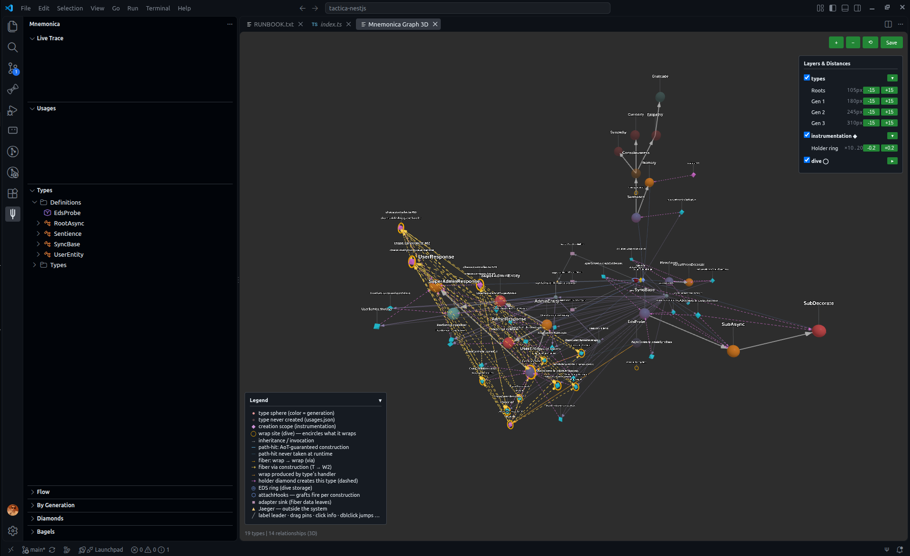

# Mnemographica Integration Example

NestJS + Mnemonica + Tactica : Visualisation

[](./screen.png)

*This repository drawn by [Mnemonica Graphica](https://github.com/mythographica/mnemographica): its own `.tactica/` artifacts rendered as an interactive 3D scene. Clone it, open in VS Code with the extension, run `Mnemonica: Ψ 3D` — `.tactica/` is committed, so the graph works from a fresh clone.*

This example demonstrates how to use **mnemonica** with **NestJS** for runtime inheritance in DTOs/entities, along with **@mnemonica/tactica** for TypeScript type generation.

## Tactica Integration

This project includes **@mnemonica/tactica** which generates TypeScript types from mnemonica entities:

```typescript
// src/entities/user.entity.ts
import type { UserEntity, UserEntity_AdminEntity } from '../../.tactica/types';
```

### Tactica Scripts

```bash
# Generate types from mnemonica entities
npm run tactica:generate

# Watch mode for development (auto-regenerate on file changes)
npm run tactica:watch
```

The generated types are located in `.tactica/types.ts`; the whole `.tactica/` directory is committed to git, so the graph tooling (mnemographica) works from a fresh clone without running tactica first.

## Overview

This example shows:

1. **Mnemonica `define()`** - Creating type hierarchies with inheritance
2. **NestJS Validation** - Using class-validator with mnemonica entities
3. **Swagger Documentation** - API docs at `/api-docs`
4. **Three-level Inheritance** - User → Admin → SuperAdmin
5. **Integration Pattern** - How mnemonica works within a NestJS application

## Project Structure

```
src/
├── dto/
│   ├── user.dto.ts          # Standard NestJS DTOs with class-validator & Swagger
│   └── async.dto.ts         # DTOs for async/await examples
├── entities/
│   ├── user.entity.ts       # Mnemonica entities with define()
│   ├── async.entity.ts      # Async constructor examples (define chains)
│   ├── eds-probe.entity.ts  # AoT-only EDS fixture (wrap scope resolution)
│   └── construction-showcase.entity.ts  # fork/clone/merge/call/apply/bind/chain tips (runnable, asserted)
├── user.controller.ts       # NestJS controllers with Swagger decorators
├── async.controller.ts      # Async/await examples controller
├── user.service.ts          # NestJS services
├── app.module.ts            # NestJS module
└── main.ts                  # Bootstrap with Swagger setup & mnemonica hooks
```

## Key Concepts

### Mnemonica Entities (entities/user.entity.ts)

Using `define()` instead of `@decorate()` for cleaner integration:

```typescript
export const UserEntity = define('UserEntity', function (this: UserData, data: UserData) {
  this.id = data.id;
  this.email = data.email;
  this.name = data.name;
});

export const AdminEntity = UserEntity.define('AdminEntity', function (this: AdminData, data: AdminData) {
  // Inherits from UserEntity
  this.id = data.id;
  this.email = data.email;
  this.name = data.name;
  this.role = data.role;
  this.permissions = data.permissions || [];
});
```

### Complete Example

**DTO with class-validator:**
```typescript
// src/dto/user.dto.ts
import { IsString, IsEmail } from 'class-validator';
import { ApiProperty } from '@nestjs/swagger';

export class CreateUserDto {
	@ApiProperty({ example: 'user@example.com' })
	@IsEmail()
	email!: string;

	@ApiProperty({ example: 'John Doe' })
	@IsString()
	name!: string;
}
```

**Entity with nested types:**
```typescript
// src/entities/user.entity.ts
import { define } from 'mnemonica';
import type { UserEntityInstance, UserResponseInstance } from '../../.tactica/types';

export const UserEntity = define('UserEntity', function (
	this: UserEntityInstance,
	data: { id: string; email: string; name: string }
) {
	this.id = data.id;
	this.email = data.email;
	this.name = data.name;
});

// Nested response type - accessible as user.UserResponse
export const UserResponse = UserEntity.define('UserResponse', function (
	this: UserResponseInstance,
	data: { id: string; email: string; name: string; type: 'user' }
) {
	this.id = data.id;
	this.email = data.email;
	this.name = data.name;
	this.type = data.type;
});
```

**Controller:**
```typescript
// src/user.controller.ts
import { Controller, Post, Body } from '@nestjs/common';
import { UserEntity } from './entities/user.entity';
import type { UserResponseInstance } from '../.tactica/types';

@Controller('users')
export class UserController {
	@Post()
	createUser (@Body() createUserDto: CreateUserDto): UserResponseInstance {
		// Create entity
		const user = new UserEntity({
			id: crypto.randomUUID(),
			email: createUserDto.email,
			name: createUserDto.name,
		});

		// Create response using nested type
		return new user.UserResponse({
			id: user.id,
			email: user.email,
			name: user.name,
			type: 'user',
		});
	}
}
```

### Swagger Integration

Swagger UI is available at `http://localhost:3000/api-docs` when the server is running.

All DTOs and controllers are decorated with Swagger annotations for automatic API documentation.

## Installation

```bash
npm install
```

## Running the Example

```bash
# Development
npm run start:dev

# Build and run
npm run build
npm start
```

The server will start on `http://localhost:3000` with Swagger docs at `http://localhost:3000/api-docs`.

## Traces & Observability

This demo is wired with [`@mnemonica/nestjs`](https://www.npmjs.com/package/@mnemonica/nestjs) — every mnemonica construction and every dive-wrapped call becomes an **OpenTelemetry span**, parented on the request it served, and the whole execution flow is recoverable after the fact. Two ways to look at the traces:

### Jaeger (OTLP export)

```bash
npm run jaegger:pre-configured   # docker all-in-one, idempotent restart
npm run demo:load                # generate traffic (chaos endpoints)
```

- Jaeger UI on `http://localhost:16686`, OTLP HTTP ingestion on `:4318` (the app exports there by default).
- The mounted UI config (`scripts/jaeger-ui.json`) adds **link patterns**: span tags become clickable jumps — `code.filepath` → the source line in VS Code, `dive.root_edge_id` / trace ID → the MnemoGraphica 3D graph (`vscode://` URIs).
- Error spans are searchable (`with_errors`): exceptions are recorded on the span with the attempted constructor args.

### Live Trace in VS Code (no Jaeger needed)

The app self-hosts the strategy WS channel in-process when `STRATEGY_CLIENT=1` is in the environment:

1. Run `STRATEGY_CLIENT=1 npm run start:dev`.
2. In VS Code with the MnemoGraphica extension: `Mnemonica: Ψ App Channel` → **Discover & Connect** (discovery via `GET http://127.0.0.1:3000/strategy/channel`).
3. Hit any endpoint (or `npm run demo:load`) — the **Live Trace** sidebar collects the edges live; clicking a trace isolates its full lineage in the 3D graph.

The full end-to-end walkthrough (extension install → graph → live traces → Jaeger loop) is in [`RUNBOOK.txt`](./RUNBOOK.txt).

## API Endpoints

### Swagger Documentation
- **URL:** `http://localhost:3000/api-docs`
- Interactive API documentation with try-it feature

### Users
- `POST /users` - Create a user
- `GET /users/:id` - Get a user

### Admins
- `POST /admins` - Create an admin (inherits User properties)
- `GET /admins/:id` - Get an admin

### Super Admins
- `POST /super-admins` - Create a super admin (3-level inheritance)
- `GET /super-admins/:id` - Get a super admin

### Async Examples
- `POST /async/root-async` - Create RootAsync instance (async constructor)
- `POST /async/root-async/result` - Create RootAsync then ResultFromDecorate (chained)
- `GET /async/root-async/:value/result/:multiplier` - GET version of chained result
- `POST /async/sync-base` - Create SyncBase
- `POST /async/sync-base/sub-async` - Create SyncBase.SubAsync (async sub-type)
- `POST /async/sync-base/sub-async/sub-decorate` - Full chain: SyncBase → SubAsync → SubDecorate
- `GET /async/sync-base/:baseValue/sub-async/:delay/:extra/sub-decorate/:decorateValue` - GET version

## Async/Await Constructor Examples

This project demonstrates **mnemonica's async constructors**. Everything is typed through tactica's `.tactica/` augmentation — `define()` chains, `lookup()` results, and nested constructors on awaited instances — so the code needs **no casts at all**: `await new` just works.

### Pattern 1: Async Constructor with Sub-types

```typescript
// src/entities/async.entity.ts
import { define } from 'mnemonica';
import type { RootAsync, RootAsync_ResultFromDecorate } from '../../.tactica/types';

const sleep = (ms: number) => new Promise<void>(resolve => setTimeout(resolve, ms));

define('RootAsync', async function (this: RootAsync, data: { value: number }) {
  await sleep(100);
  this.value = data.value;
  this.computed = data.value * 2;
  return this;
})
.define('ResultFromDecorate', function (this: RootAsync_ResultFromDecorate, multiplier: number) {
  this.result = this.computed * multiplier;
  this.timestamp = Date.now();
  return this;
});
```

Usage:
```typescript
// src/async.controller.ts — lookup() returns the fully typed constructor
const RootAsync = lookup('RootAsync');

const rootAsync = await new RootAsync({ value: 42 });
const resultDecorate = await new rootAsync.ResultFromDecorate(3);
// resultDecorate.computed = 84, resultDecorate.result = 252
```

### Pattern 2: Chained sub-types (SyncBase → SubAsync → SubDecorate)

```typescript
// src/entities/async.entity.ts — a plain define() chain, still no casts
define('SyncBase', function (this: SyncBase, data: { baseValue: string }) {
  this.baseValue = data.baseValue;
})
.define('SubAsync', async function (this: SyncBase_SubAsync, asyncData: { delay: number; extra: string }) {
  await sleep(100);  // Simulate long operation
  this.delay = asyncData.delay;
  this.extra = asyncData.extra;
  this.processed = `${this.baseValue}-${asyncData.extra}`;
  return this;
})
.define('SubDecorate', function (this: SyncBase_SubAsync_SubDecorate, decorateValue: string) {
  this.decorateValue = decorateValue;
  this.combined = `${this.processed}:${decorateValue}`;
  return this;
});
```

Usage:
```typescript
// new SyncBase (sync constructor), then await the async sub-type, then chain
const SyncBase = lookup('SyncBase');

const syncBase = new SyncBase({ baseValue: 'hello' });
const subAsync = await new syncBase.SubAsync({ delay: 100, extra: 'world' });
const subDecorate = await new subAsync.SubDecorate('decorated');
// subDecorate.combined = "hello-world:decorated"
```

### Key Concepts for Async Constructors

1. **`await new Type()` just works** — an async constructor returns a Promise; `await` unwraps the fully-typed instance
2. **No casts, ever** — no `as unknown as`, no `as SomeType`: tactica's `.tactica/` augmentation types `define()` chains, `lookup()` results, and nested constructors on awaited instances as-is
3. **`return this` is required** - The constructor must return the instance
4. **Sub-types are accessible after await** — `rootAsync.ResultFromDecorate`, `subAsync.SubDecorate`
5. **Sleep simulates real async operations** - Database calls, HTTP requests, etc.

See the full implementation in:
- `src/entities/async.entity.ts` - Entity definitions
- `src/async.controller.ts` - API endpoints
- `src/dto/async.dto.ts` - Request/response DTOs

## Example Requests

Using the Swagger UI at `http://localhost:3000/api-docs`:

1. Navigate to the Swagger UI
2. Expand the desired endpoint (e.g., `POST /users`)
3. Click "Try it out"
4. Enter the request body:
   ```json
   {
     "email": "user@example.com",
     "name": "John Doe"
   }
   ```
5. Click "Execute"

Or using curl:

```bash
# Create a user
curl -X POST http://localhost:3000/users \
  -H "Content-Type: application/json" \
  -d '{"email":"user@example.com","name":"John"}'

# Create an admin
curl -X POST http://localhost:3000/admins \
  -H "Content-Type: application/json" \
  -d '{"email":"admin@example.com","name":"Admin","role":"admin","permissions":["read","write"]}'

# Create a super admin
curl -X POST http://localhost:3000/super-admins \
  -H "Content-Type: application/json" \
  -d '{"email":"super@example.com","name":"Super","role":"superadmin","permissions":["read","write","delete"],"domain":"global"}'

# Async Pattern 1: RootAsync then ResultFromDecorate
curl -X POST http://localhost:3000/async/root-async/result \
  -H "Content-Type: application/json" \
  -d '{"value":42,"multiplier":3}'

# Async Pattern 2: Sync -> SubAsync -> SubDecorate (full chain)
curl -X POST http://localhost:3000/async/sync-base/sub-async/sub-decorate \
  -H "Content-Type: application/json" \
  -d '{"baseValue":"hello","delay":100,"extra":"world","decorateValue":"decorated"}'
```

## Construction Mechanics (tactica ≥ 0.3.9)

Beyond plain `new`, tactica records every construction shape as an `instantiation` in `.tactica/usages.json` — byte-indistinguishable from `new` until the deferred mechanism-kind revision (the callee text stays readable via `constructorText`):

- **fork / clone** — `instance.fork()` (re-runs the constructor; the result is a distinct instance parented on the source) and `instance.clone` in both the property form (`readonly clone: this`) and the call form. mnemonica 1.3+ does not auto-inject these — each type opts in from `utils` (see `MechanicsRoot` in the showcase).
- **utils.merge(a, b)** — a's type re-run over b's context.
- **call / apply / bind** — typed construction without `new`; import-aware (named imports from `mnemonica` only). `bind` records no usage by contract — the bound call is not followed.
- **chain tips** — `new Root(...).Nested(...)` and the awaited form `await new Root(...).AsyncNested(...)`; the tip call records the usage and the result binds to the tip type.

`src/entities/construction-showcase.entity.ts` exercises all of them against real instances with runtime assertions (instanceof, extracted fields, parse-parent lineage), and `npm run check:integration` both executes the showcase and polices the recorded `.tactica/usages.json` entries.

## How Tactica Detects This

When you run `npx tactica` in this project, it will:

1. Detect the `define()` calls in `entities/user.entity.ts`
2. Build the type hierarchy: UserEntity → AdminEntity → SuperAdminEntity
3. Generate type definitions in `.tactica/types.ts`

## Benefits of This Pattern

1. **Runtime Inheritance** - Mnemonica provides prototype chain inheritance
2. **Type Safety** - TypeScript interfaces ensure compile-time safety
3. **Validation** - class-validator ensures runtime data integrity
4. **API Documentation** - Swagger provides interactive API docs
5. **Clean Architecture** - Separation of concerns (DTOs, Entities, Controllers)

## Notes

- This example uses `define()` instead of `@decorate()` to avoid decorator conflicts
- The `new Entity(data)` pattern creates mnemonica instances
- Each entity has mnemonica's internal properties like `__type__`
- Swagger decorators provide automatic API documentation
